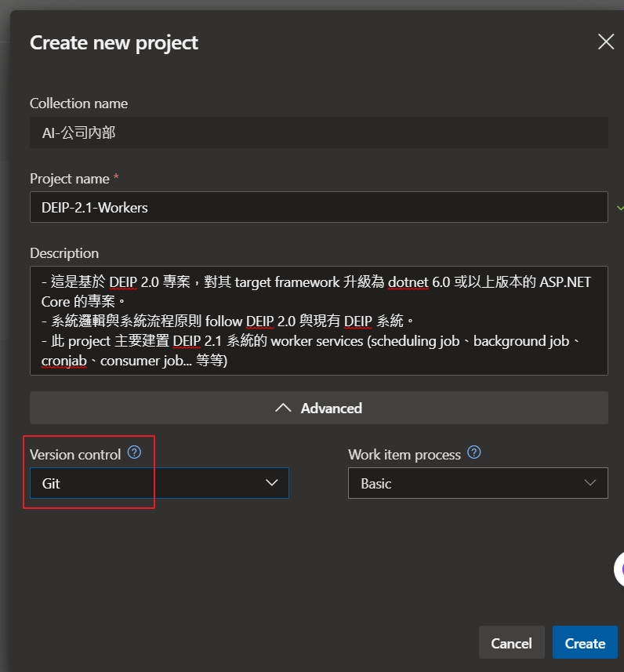
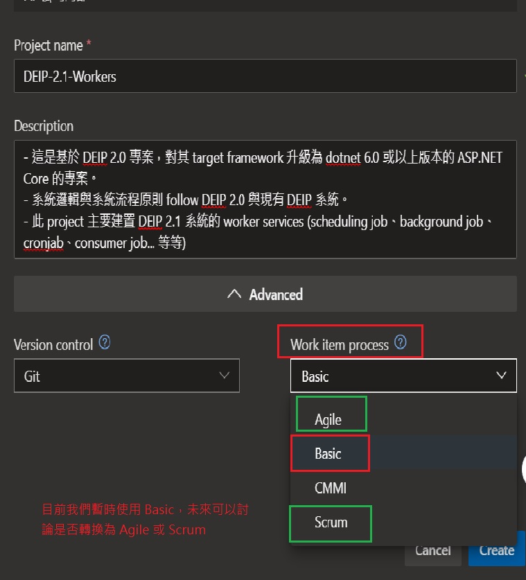

# Dynasafe AI Team 團隊開發流程

----------------

- 以下文件說明 AI Team 團隊的基本開發流程。
- 以下所有都是初期的建議，沒有強制性，所有流程與作法皆可以討論。

----------------

## 建立 Azure DevOps 新的專案

- Step 1. 在正確的 **路徑上選擇 Create new project**。
- Step 2. 輸入 project name，可以使用 `-` 或 `_` 字元，雖然 Azure DevOps 允許你 prject name 使用中文名稱，**但為了之後建置 CI/CD pipelines 以及 Git Repo 避免與到一些奇怪的字元集或編碼問題，強烈建議都使用純英文與數字當作 project name，也盡量在 project name 中使用「空格」字元，也避免使用 `/` 或 `\` 字元**，您可以使用 `-` 或 `_` 當作空格字元。
  - Windows 系統: 我永遠也搞不懂他預設的編碼與字元集。
  - macOS 系統: 標準 UTF-8 與 Unicode。
  - Linux 系統: 標準 UTF-8 與 Unicode。
    - 因此當有人對同一份原始檔輸入了 **非 ascii-code** 以外的字元時，你永遠不會知道你的系統與編輯器會自動幫你用哪一種字元集和編把處理。

  - KevinW 目前制定的 Azure DevOps Project Naming Rule: `{客戶名稱}_{PID}_{ProductName}`
    - 全英數。
    - 客戶名稱: 如果是公司內部系統則使用: `Dynasafe`
    - PID: 如果是公司內部系統則使用: `0`

  - 目前 DEIP 相關的 project 的 project naming rule 如以下。
    - 固定前綴 Prefix: `Dynasafe_0_DEIP`
    - 後綴字 Postfix:
      - `API`: 用來存放 internal api 或 intergation api 的專案，可能以 ASP.NET Core Web API、Python FastAPI 或 Nodejs Express 實作的 http api。
        - 這種 application 只用於回傳資料並請進行資料交換，完全跟任何 UI 畫面無任何關係，意味著沒有 `.cshtml`、`.html`、`.css` 或 `.vue` 這種東西存在。
        - 實際上此專案的可以是使用任何 internal zone 能協同 RPC 呼叫或資料交換的 protocol 實作。
          - `HTTP API`: ASP.NET Core Web API 或 Python FastAPI
          - `gRPC`: ASP.NET Core with gRCP Service
          - `Socket`: ASP.NET Core with a self-host socket service
          - `Message Broker`: ASP.NET Core implemented with message broker
        - 此為前後端完全分離的架構。

      - `Worker`: 用來存放是常駐型的背景服務、例行性排程工作 (Quartz Job 或 cronjob) 或 Message Broker Consumer Worker 的應用程式。
      - `Website`: 用來存放 website 類型或者 aggregator api 類型的專案。
        - .NET Core 3.1 or .NET 6.0 以上
          - [ASP.NET Core MVC Website](https://learn.microsoft.com/zh-tw/aspnet/core/mvc/overview?view=aspnetcore-7.0)
          - [ASP.NET Core Razor Pages](https://learn.microsoft.com/en-us/aspnet/core/razor-pages/?view=aspnetcore-7.0&tabs=visual-studio)
        - Nodejs or Vuejs
          - [Nodejs Express MVC Website](https://blog.logrocket.com/building-structuring-node-js-mvc-application/)
          - [Nuxtjs Website](https://www.nuxtjs.cn/)
        - Python
          - [Python Flask Website](https://flask.palletsprojects.com/en/2.3.x/)
        - .NET Framework (ASP.NET)
          - ASP.NET MVC
          - ASP.NET WebForm

      - `WebsiteFrontend`: 用來存放前後端分離後 **單純前端** 的專案，譬如 vue 3.0 的專案。
      - `Database`: 用來存放關聯式資料庫所有 object 和 schema 版本控管的專案，無論是 MSSQL、PostgreSQL 或 MySQL 任何一種資料庫。
      - `Infa` 或 `DevOps`: 用來存放建置 infra、建置基礎環境以及相關的設定檔與 shell script 或 python script。
        - 未來如果實作 ELK 架構，譬如 td-agent 的設定，或者 fluentd 的 compose 可能存放於此。
        - 未來如果建置 Elasticsearch，其 index template 與其 reindex 或 data patch script 可能存放於此。
      - `Configs`: 代表此專案針對不同 **環境別** 特定的應用程式設定組態。
        - 譬如:
          - ASP.NET Core 的 `appsettings.json` 中的設定值。
          - ASP.NET MVC 或 Web API 的 `web.config` 設定檔。
          - Python FastAPI 的 `config.yaml` 中的設定值。
        - 此專案可能會搭配 **HarsiCorp Vault** 服務進行管控。
      - `CICD`: 視情況存放專案的自動化佈署腳本。
        - shell script
        - python script
        - dockerfile and docker-compose.yml
        - azure devops ci pipeline yaml
        - azure devops cd pipeline yaml
        - ansible playbook
        - any configuration about ci/cd
      - `Tools`: 存放工具類型的應用程式的專案。
        - 可能是 dotnet tool cil 專案。
        - 可能是 GUI tool 專案。

    - 以上不是強制性 project naming rule，只是建議，未來可能會有其他類型的 project，譬如 `Library` 用來存放共用的 common 與 kernel library package 原始碼的專案。

- Step 3. 選擇版本控管機制
  - 一般而言，我們都選擇 **Git**，如下圖。

    

- Step 4. 選擇 Azure DevOps Board 團隊作業的流程樣板
  - 目前我們暫時先選擇 **Basic**，比較容易先上手學習。
  - 等團隊成員都開始習慣這種工作流程與模式，可以討論是否將樣板換成 **Agile** 或 **Scrum**。

    

----------------

## Step 1. 在 Azure DevOps 上建立工作項目 (Work Item)。

- **目的**: 為了讓整個團隊有一個統一的地方可以觀察、管理、分派所有成員目前的工作狀態，也便於 team leader 統一管理所有專案。

## 以下大致說明 Azure DevOps Board 的一些 term。

### Iterations

- 反覆項目，或稱迭代週期。
- project leader 或 team leader 可以於此定義出此 project 有幾個 sprint。
- sprint 可以**設定起始與結束日期**，通常 **一般為兩週**。

### Area

  - 區域小組。
  - project leader 可以定義此 project 中，每一項 work item 分別在哪個 area 中。
  - 概念類似於此 project 中再針對特定的 work item 進行分組歸類。
  - 優點是，如果此 project 項目較大，有很多 member 同一個 sprint 可能分工同時執行不同類型的 work item，利用 area 區分可以讓 board 或 backlog 比較易於管理與追蹤。
  - 如果較小的 project 則不一定需要區分很多 area，可以視 project 與 work item 類型決定。
    - References: [一次搞懂 Azure Boards 的 Iterations, Areas 與 Teams 差異之處](https://blog.miniasp.com/post/2023/01/11/Understanding-Azure-Boards-Iterations-Areas-Teams-Difference)

### Work Item

- 工作項目
- 在 Azure DevOps Board 中所有「工作任務」都可以視為一種 work item，以下先以 DEIP 2.0 project 中的工作項目類型說明。
  - `Epic` (在 Azure DevOps 沒有中文翻譯)
    - 代表一個比較大項工作任務或者系統需求，有可能需要在不同的 sprint 中反覆迭代幾次才能完成的 work item。
    - 通常也可以視為一個需求端的 use case 或 user story。

  - `Issue` (在 Azure DevOps 中文翻譯為 **問題**)
    - 實際上這不見得是一個真的「問題」，代表的其實是在此 project 中可能需要被討論或者需要被處理的工作與任務。
    - 類似於 GitHub 或 GitLab 上的 issue。
    - 通常 issue 都屬於比較具體、明確，較小的 work item，而且理論上都應該歸屬在某一個 Epic 之下。

- 實際上在 Azure DevOps Board 中有其他的類型的 work item，以上只以 DEIP 2.0 專案有的進行說明。

### Tag

- 標記 or 標籤。
- 每一個與每一種 work item，可以利用 tag 額外標記一些特別的屬性，也是為了再分類，方便追蹤與管理。
- 以 DEIP 2.0 project 為例，預先定義好的 tag 如下。

- `Epic` 類型的 tag。
  - `UserStory`
    - 代表使用者案例。
    - 顏色為 **藍色**。

- `Issue` 類型的 tag。
  - `Feature`
    - 代表一個實際需要完成的功能，通常會是一個新需求的功能。
    - 顏色為 **淺綠色**。

  - `Task`
    - 代表一個實際需要被完成的任何一種工作或任務，包括: 技術支援、建置環境、trouble shooting、研究新舊技術、文件撰寫... 等等。
    - 顏色為 **深綠色**。

  - `Test`
    - 代表一個測試類型的 work item，可以是 unit test、api test、integration test、實際在系統進行手動測試... 等等。
    - 顏色為 **橘黃色**。

  - `Issue`
    - 代表一個可能待討論、待確認的 work item，此種類型的 work item 可以依照討論或確認結果之後，在開其他的 work item，或者直接關閉此 work item。
    - 顏色為 **淺紫色**。

  - `Bug`
    - 代表一個任何的 bug，可以由任何人認定這個 bug，並且 bug 不限於只在系統畫面上被測試出來的才算 bug，也不是只有不符合在 spec 規格定義中有明確定義的才能算 bug。
      - **任何人只要認為系統或應用程式存在不符合正常預期，或有淺在性風險的問題**，都可以視為 bug。
      - 但 bug 也**可以跟 team member 討論，反覆確認是真的為一個 bug**。
    - 顏色為 **鮮紅色**。

  - `Refactor`
    - 代表一個對於系統或應用程式重構類型的 work item，這邊廣泛定義重構: **重構後的功能應與重構前「完全一致」**。
    - 顏色為 **深灰色**。

  - `Optimize`
    - 代表一個對於系統或應用程式優化的 work item，可能是效能調教、安全性修正、畫面 UI/UX 優化、程式碼更換實作方法... 等等任何對系統有好處的工作。
    - 顏色為 **深紫色**。

- 在 Azure DevOps 中對於 work item 可以自行標記 free tag，代表 member 可以自行標記一些自己方便追蹤或管理的 tag，不限於以上的 tag。
- 在 Azure DevOps 中每一個 work item 都可以標記多個 tag， 包括以上 project 預先定義好顏色的 tag。
  - 譬如: 某一個 work item 可以同時標記上 `Refactor` 和 `Optimize`。
  - 但建議標記 tag 時，意義上不要相互牴觸就好。

### Status of Work Item

- `待辦事項`
  - 尚未實際開始處理。
  - 已經處理中，但是因為某些原因 pending，目前又沒有再處理的 work item。

- `正在執行`
  - 目前已經實際在處理中。

- `完成`
  - 依照 work item 的工作內容描述，已經確實完成。
  - `Issue` 類型的 work item 通常完成了就可以切換到此狀態。
  - `Epic` 類型的 work item 通常會等到下屬所有 `Issue` 都完成了，才會切換到此狀態。

### Details of Work Item

- Title: 一定必須要撰寫。
- Description:
  - 建議大致描述工作內容。
    - 格式目前不拘。
    - 如果為功能開發，又沒有 spec 文件的情況下，可以適當地描述基本的規格。
    - 如果可以描述出「最低驗收標準」會更好。

- Comment:
  - 任何有關於此 work item 的討論紀錄，或是個人紀錄都可以 comment 於 work item 上。
  - 若有需要可以 `@` 標註 project member，用於同步有關此 work item 的一些工作狀態與資訊。

- Attachment:
  - 所有 work item 都可以有附件，可以將相關文件與資料使用附件的方式附加在 work item 上。
  - 如果此 project 有 BA 或 SA 轉寫的 spec 規格書文件，建議也可以附加在 work item 上。

- 補充
  - 在 `Description` 或 `Comment` 都可以把跟此 work item 有關的 **連結** 記錄下來，可以是公司內部知識庫的連結，可以是外部的技術文件、技術部落格文章... 等等。
  - work item 之間可以做 **關聯**。
  - Azure DevOps 允許直接從 work item 建立出一個新的 git branch 進行開發，但目前 DEIP 2.0 project 不會採用這種方式。
  - work item 可以關聯到 git repo 中的: commit 和 pull request。

----------------

## Step 2. 從 Azure DevOps Repo 中取得程式碼開始工作

- 1. `git clone` 或者 `git pull` 原始碼到 localhost。
- 2. 先執行 `dotnet build` 或 `yarn install && yarn serve`，確認原始碼可以正常 build 成功。
- 3. 依照 work item 在 localhost 建立新的 git branch 開始進行工作。
  - git branch 命名規則如下:
    - `feature/{user_name}/{work_item_no}`
    - `task/{user_name}/{work_item_no}`
    - `bugfix/{user_name}/{work_item_no}`
    - `refactor/{user_name}/{work_item_no}`
    - `hotfix/{user_name}/{work_item_no}`
- 4. 完成 coding 與功能開發之後，在 localhost 進行測試。
  - localhost 進行測試。
  - unit test。
- 5. git push 自己建立的 branch 到 Azure DevOps Repo 上。
- 6. 在 Azure DevOps Repo 上發起一個 Pull Request。
  - Pull Request 請相關的 project member 進行 code review。
  - Pull Request 放行規則可以再詳細討論。
- 7. Pull Request 被 approved 之後，merge 程式碼到 `develop` 分支上。

----------------

## Step 3. 佈署與測試

- 從 `develop` 分支上把 application 佈署到公司內部 project member 共用的 dev 或 lab 環境進行測試。
  - 測試通過: work item 即可切換為「完成」。
  - 測試不通過: 重新把 `develop` 分支的程式碼 checkout 並且 merge 自己原有或新的 branch 反覆進行修正，直到測試通過為止。
    - 建議把測試時期發現的 bug 紀錄在 work item 的 comment 上。
      - 可以進行畫面截圖，描述出 bug 怎麼發生。
      - 在 debug 過程中建議能紀錄 bug 的 root cause，以及如何 bugfix。
    - 是情況可以另外開 bug 的 work item。

----------------

## 以下為補充

- 建立出的 work item 都是可以跟所有 team member 討論，是否確實有需要去執行。
- 建議不要直接刪除 **別人建立的 work item**。
- 所有 work item 的指派都可以重新 reassign 給 project member 中其他成員。

