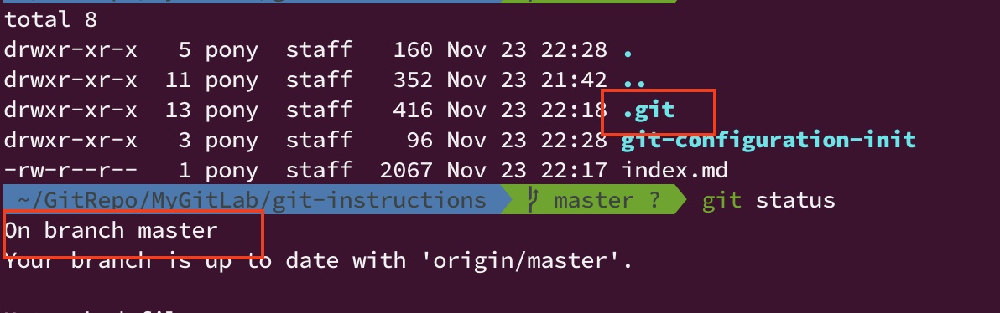

# Git Configuration & Git Init

## Git Config

- git 的組態設定其實有區分 **全域** 或 **依照每一個 git repository (git 儲存倉儲)**。
- 當 git repo 的設定與全域性設定相同時，git repo 的設定值會覆蓋掉全域性的設定。
- 但這些設定基本上都是設定在 **本地端 (local)**。

### 設定 git 的使用者基本資訊

- 查看全域設定

  - `git config --global --list`
  
    ```
    user.name=ponylin1985
    user.email=ponylin1985@gmail.com
    http.sslverify=false
    pull.rebase=false
    core.editor=nano
    ```

- 設定全域性的使用者姓名

  - `git config --global user.name {user_name}`

    - `user_name`: 使用者姓名。
      - 如果是 remote 是 GitLab，`user_name` 通常會是 GitLab 帳號名稱。

  - 範例: 
    - `git config --global user.name "happybear1234"`
    - `git config --global user.name 'pony.lin'`

- 設定全域性的使用者 email 位址

  - `git config --global user.email {user_email}`

  - 範例: 
    - `git config --global user.name "pony.lin123@yahoo.com"`

----------------------

## Git Repo & Git Init

- 每一個 git repo 都有各自的版本控管，完全不相關，無論 local 或 remote。
- 初始化一個本地端 local 的 git repostiory。
- 只有在初始化完成之後，在該路徑在執行 `git status` 才會提示說這是一個 git repo。

### Git Init

- 建立並且初始化一個 git repo。

  - `git init`

- 當 `git init` 執行完成之後，在同一個目錄下，會產生一個 `./.git` 的隱藏目錄，這代表這個目錄是一個 local git repo，有被 git 進行版本控管，這個 **$`\textcolor{red}{\text{路徑就是 git repo 的根目錄}}`$**。
- `./.git` 路徑下的檔案，平常一班操作不建議自行修改，除非是要改一些 **git submodule** 相關的設定值，否則一般操作不太需要去修改。
- 使用 `git status` 指令查看，應該會有以下的結果。

  

- 設定此 local git repo 的使用者，因為 git 會需要紀錄是「由誰」在「什麼時間」異動過這個 repo 的檔案。
- 如果沒有各別在 local git repo 設定，git 會自動使用全域的使用者設定。
- 如果有在各別的 local git repo 設定，git 則會優先使用該 repo 的使用者設定。

  - `git config --local user.name {user_name}`

    - `user_name`: 使用者姓名。
      - 如果是 remote 是 GitLab，`user_name` 通常會是 GitLab 帳號名稱。

    - 範例: 
      - `git config --local user.name "john5278"`

  - `git config --local user.email {user_email}`

    - `user_email`: 使用者的 email 位址。
      - 如果是 remote 是 GitLab，`user_email` 通常會是用來註冊 GitLab 的 email。

    - 範例: 
      - `git config --global user.name "amber5278@gmail.com"`

- 查看 local repo 的 git 組態設定。

  - `git config --local --list`

### Git Ignore

- 在 git repo 中，有一些檔案是 **不需要被加入到版本控管中的**，譬如每一次程式 build 或 run 之後產生的 binary 檔案或一個跟個人相關的設定檔。
  - 譬如: dotnet project 的 `bin`、`obj` 目錄以及 `*.dll` 檔案。
  - 譬如: node.js project 的 `node_modules` 目錄。
  - 譬如: python project 每次執行後產生的 `__pycache__` 目錄 與 `*.pyc` 或 `*.pyo` 檔案。
  - 譬如: 一些圖片檔案 `*.jpg` 或 `.png` 等等。

- 在每一個 git repo 中，都可以使用 `.gitignore` 設定檔去設定說: 哪一個檔案是不需要被加入到 git 版本控管中的。
  - 可以各別特定某一個檔案。
  - 可以指定某一種副檔名的檔案。
  - 可以指定一個或多個目錄下的所有檔案。

- 以下為 `.gitignore` 檔案範例

```ini
__pycache__/
*.py[cod]

*.pyc
*.pyo
```

----------------------

- References
  - [有些檔案我不想放在 Git 裡面](https://gitbook.tw/chapters/using-git/ignore.html)
  - [Best practices for adding .gitignore file for Python projects?](https://stackoverflow.com/questions/3719243/best-practices-for-adding-gitignore-file-for-python-projects)
  - [gitignore/Python.gitignore](https://github.com/github/gitignore/blob/master/Python.gitignore)

----------------------

### [回到目錄](../index.md#目錄)

