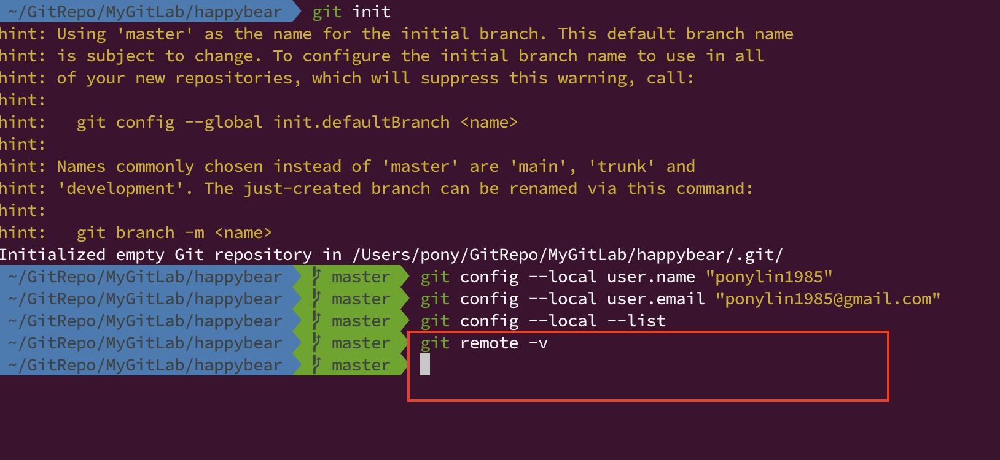
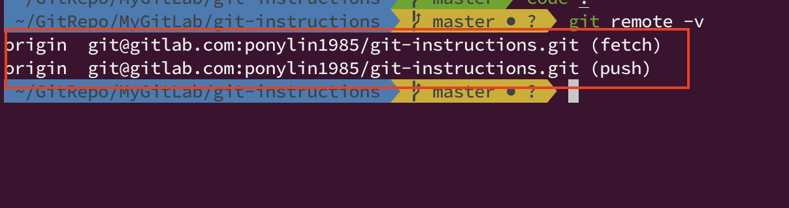
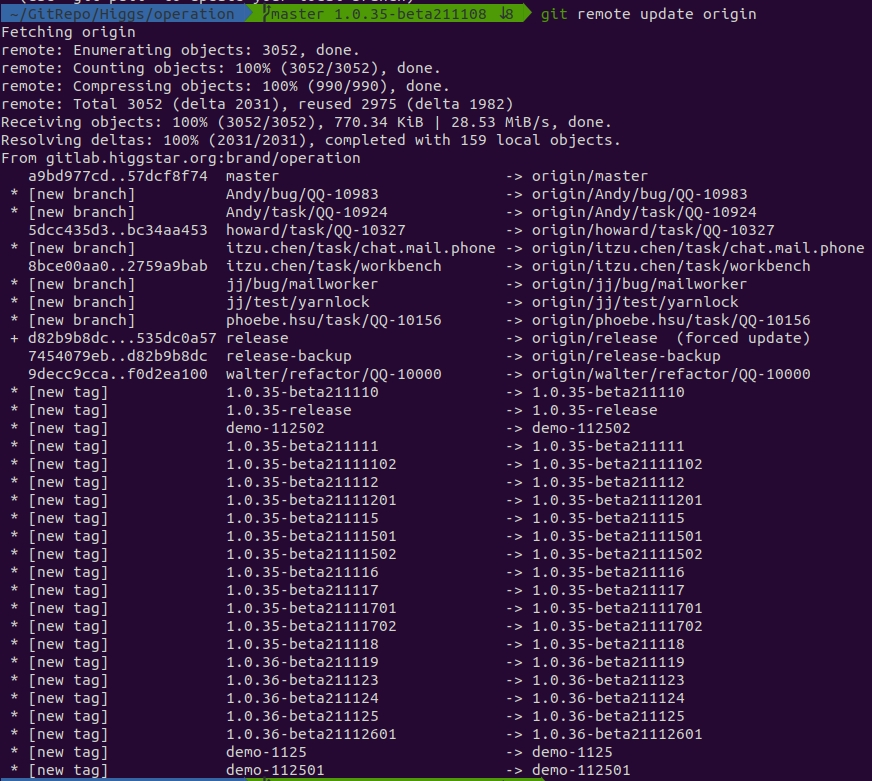
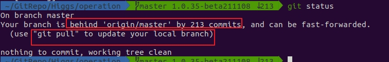

# Git Remote

- git 設計為離線式且分散式的版本控管工具，實際上，在 git 真正的概念中並沒有類似於傳統舊式的版本控管工具 (譬如: VSS、TFS 或 SVN) 具有 version control server 與 client side 的概念。
  - 集中式版本控管系統: VSS、TFS 或 SVN。這種的版本控管實際上是集中在 server side 進行統一控管，client side 只是利用網路連線連接到 version control server 之後取得檔案，在本地端更新異動之後，把異動的結果上傳到 server side，由 server side 統一進行管理。
  - 分散式版本控管系統: Git。其實沒有 server side 與 client side 的概念，每一個 git repo 都可以有完全獨立並且完整的版本控管功能，並且每一個安裝 git 的 repo 實際上都可以被當作是另一台主機上的 git repo 的 **遠端倉儲 (remote repo)**。
    - 實際上著名的原始碼版本控管倉儲服務，譬如: GitHub、GitLab、Azure DevOps Repository 或 BitBucket，本質上他們都只是安裝了 git，跟你在自己的電腦上安裝了 git 沒有不同。

## Show Remotes

- 查看 local repo 是否設定了 **「遠端的」git repo**，列出 remote repo 列表。

  - `git remote -v`

    - 如果還沒有在 local repo 設定對應的 remote repo，則不會有任何輸出，如下圖。

      

    - 如果已經在 local repo 中設定了 remote repo，則會列出所有的 remote repo，如下圖。

      

      - 格式為: `{remote_name} {remote_url} ({remote_type})`
        - `remote_name`: 遠端 remote repo 的名稱。
        - `remote_url`: 遠端 remote repo 連線的 URL，可以是 ssh protocol 或是 https protocol。
        - `remote_type`: 遠端的類型。
          - **fetch**: 代表這個 local repo 是從這個 remote repo 抓取檔案和 git commit 下來。
          - **push**: 代表這個 local repo 會把檔案異動與 git commit 推送到這個 remote repo 上。
          - 通常一般情況下，fetch remote 和 push remote 其實會設定成一樣，但其實 $`\textcolor{red}{\text{當然也是可以設定成不一樣的! 這就是分散式版本控管!}}`$。

      - 一般情況下，一個 local repo 可能只有設定一個 remote repo，但其實當然是能設定成多個 remote repo，當執行 `git remote -v` 之後，會有類似以下的輸出。

        ```
        bakkdoor  https://github.com/bakkdoor/grit (fetch)
        bakkdoor  https://github.com/bakkdoor/grit (push)
        cho45     https://github.com/cho45/grit (fetch)
        cho45     https://github.com/cho45/grit (push)
        defunkt   https://github.com/defunkt/grit (fetch)
        defunkt   https://github.com/defunkt/grit (push)
        koke      git://github.com/koke/grit.git (fetch)
        koke      git://github.com/koke/grit.git (push)
        origin    git@github.com:mojombo/grit.git (fetch)
        origin    git@github.com:mojombo/grit.git (push)
        ```

      - 一般情況下，git 會把預設的 remote repo name 設定為 **origin**，但其實你也可以把 origin remote 重新命名改掉，是沒有問題的。

- 對 remote repo 進行 rename 操作。

  - `git remote rename {old_remote_name} {new_remote_name}`

    - `old_remote_name`: 原始舊的 remote 名稱。
    - `new_remote_name`: 新的 remote 名稱。

  - Reference: [How do I rename an existing Git remote?](https://support.beanstalkapp.com/article/1000-how-do-i-rename-an-existing-git-remote)

----------------------

## Add Remote

- 把已經存在的 remote git repo 加入到 local repo 中。

  - `git rmeote add {remote_name} {remote_repo_url}`

    - `remote_name`: 遠端 remote repo 的名稱，可以自行給定一個名稱，預設會是 **origin**。
    - `remote_repo_url`: 遠端 remote repo 的連線 URL 位址。
      - 可以是 ssh URL 連線位址。
      - 也可以是 https URL 連線位址。
        - 如果 remote repo 使用的 SSL 憑證是「自我憑證架的服務」在進行連線時，可能會遇到類似 `fatal: unable to access 'https://localhost/winnie/test.git/': SSL certificate problem: self signed certificate` 憑證驗證錯誤的訊息。
        - 可以使用 `git config http.sslVerify false` 將 git 驗證憑證的功能停用。

----------------------

## Remove Remote

- 把已經加入到 local repo 中的 remote repo 移除。

  - `git rmeote remove {remote_name}` 或 `git remote rm {remote_name}`

    - `remote_name`: 遠端 remote repo 的名稱，可以使用 `git remote -v` 查看，如果沒有輸入，預設為 **origin**。

----------------------

## Set Remote URL

- 更新 remote repo 連線的 URL 位址。

  - `git remote set-url {remote_name} {new_remote_repo_url}`

    - `remote_name`: 遠端 remote repo 的名稱，可以使用 `git remote -v` 查看，如果沒有輸入，預設為 **origin**。
    - `new_remote_repo_url`: 新的 remote repo 的 URL 連線位址。

  - `git remote set-url --push {remote_name} {new_remote_repo_url}`

    - 把 `remote_name` 的 **push** 的 remote repo URL 重新進行設定。

  - `git remote set-url --fetch {remote_name} {new_remote_repo_url}`

    - 把 `remote_name` 的 **fetch** 的 remote repo URL 重新進行設定。


- [http://hady.geek.nz/blog/different-remote-push-url-git/](http://hady.geek.nz/blog/different-remote-push-url-git/)


----------------------

## Remote Update (同步 remote repo 的資訊)

- 同步更新 remote repo 所有的遠端 branch 與 commit 到 local repo。

- `git remote update {remote_name}`

  - `remote_name`: 遠端 remote repo 的名稱，可以使用 `git remote -v` 查看，如果沒有輸入，預設為 **origin**。
  - 執行這個指令時效過差不多等同 `git fetch --all` 這個指令。
    - 當這個指令執行完成時，遠端所有的 commit 會被抓取到 local repo，但是並不會直接更新 branch 上的 commit，因為這些 commit 會備暫存在 `FETCH_HEAD` 上。

  - 當執行完 `git remote update` 完成之後，建議都執行一下 `git status`，查看一下當前 local repo 的狀態。

    - 當 `git remote update` 執行完成之後，如果 remote repo 有一些 commit 被更新，則會顯示出類似以下的訊息。

      ```
      Fetching origin
      remote: Enumerating objects: 3052, done.
      remote: Counting objects: 100% (3052/3052), done.
      remote: Compressing objects: 100% (990/990), done.
      remote: Total 3052 (delta 2031), reused 2975 (delta 1982)
      Receiving objects: 100% (3052/3052), 770.34 KiB | 28.53 MiB/s, done.
      Resolving deltas: 100% (2031/2031), completed with 159 local objects.
      From gitlab.higgstar.org:brand/operation
        a9bd977cd..57dcf8f74  master                         -> origin/master
      * [new branch]          Andy/bug/QQ-10983              -> origin/Andy/bug/QQ-10983
      * [new branch]          Andy/task/QQ-10924             -> origin/Andy/task/QQ-10924
        5dcc435d3..bc34aa453  howard/task/QQ-10327           -> origin/howard/task/QQ-10327
      * [new branch]          itzu.chen/task/chat.mail.phone -> origin/itzu.chen/task/chat.mail.phone
        8bce00aa0..2759a9bab  itzu.chen/task/workbench       -> origin/itzu.chen/task/workbench
      * [new branch]          jj/bug/mailworker              -> origin/jj/bug/mailworker
      * [new branch]          jj/test/yarnlock               -> origin/jj/test/yarnlock
      * [new branch]          phoebe.hsu/task/QQ-10156       -> origin/phoebe.hsu/task/QQ-10156
      + d82b9b8dc...535dc0a57 release                        -> origin/release  (forced update)
        7454079eb..d82b9b8dc  release-backup                 -> origin/release-backup
        9decc9cca..f0d2ea100  walter/refactor/QQ-10000       -> origin/walter/refactor/QQ-10000
      * [new tag]             1.0.35-beta211110              -> 1.0.35-beta211110
      * [new tag]             1.0.35-release                 -> 1.0.35-release
      * [new tag]             demo-112502                    -> demo-112502
      * [new tag]             1.0.35-beta211111              -> 1.0.35-beta211111
      * [new tag]             1.0.35-beta21111102            -> 1.0.35-beta21111102
      * [new tag]             1.0.35-beta211112              -> 1.0.35-beta211112
      * [new tag]             1.0.35-beta21111201            -> 1.0.35-beta21111201
      * [new tag]             1.0.35-beta211115              -> 1.0.35-beta211115
      * [new tag]             1.0.35-beta21111501            -> 1.0.35-beta21111501
      * [new tag]             1.0.35-beta21111502            -> 1.0.35-beta21111502
      * [new tag]             1.0.35-beta211116              -> 1.0.35-beta211116
      * [new tag]             1.0.35-beta211117              -> 1.0.35-beta211117
      * [new tag]             1.0.35-beta21111701            -> 1.0.35-beta21111701
      * [new tag]             1.0.35-beta21111702            -> 1.0.35-beta21111702
      * [new tag]             1.0.35-beta211118              -> 1.0.35-beta211118
      * [new tag]             1.0.36-beta211119              -> 1.0.36-beta211119
      * [new tag]             1.0.36-beta211123              -> 1.0.36-beta211123
      * [new tag]             1.0.36-beta211124              -> 1.0.36-beta211124
      * [new tag]             1.0.36-beta211125              -> 1.0.36-beta211125
      * [new tag]             1.0.36-beta21112601            -> 1.0.36-beta21112601
      * [new tag]             demo-1125                      -> demo-1125
      * [new tag]             demo-112501                    -> demo-112501
      ```

      

    - 這個時候執行 `git status`，如果出現以下訊息，代表可以直接使用 `git pull` 或 `git merge FETCH_MERGE` 指令確實更新 local repo 當前的 branch。

      ```
      On branch master
      Your branch is behind 'origin/master' by 213 commits, and can be fast-forwarded.
        (use "git pull" to update your local branch)

      nothing to commit, working tree clean
      ```

      

----------------------

- References

  - [Git 基礎 - 與遠端協同工作](https://git-scm.com/book/zh-tw/v2/Git-基礎-與遠端協同工作)

----------------------

### [回到目錄](../index.md#目錄)

