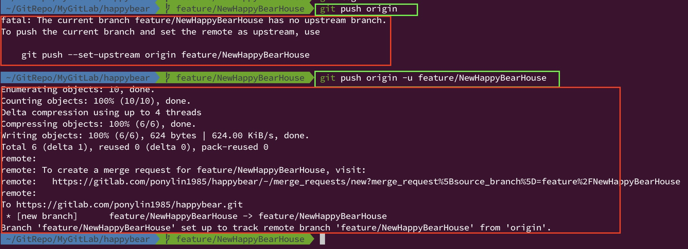
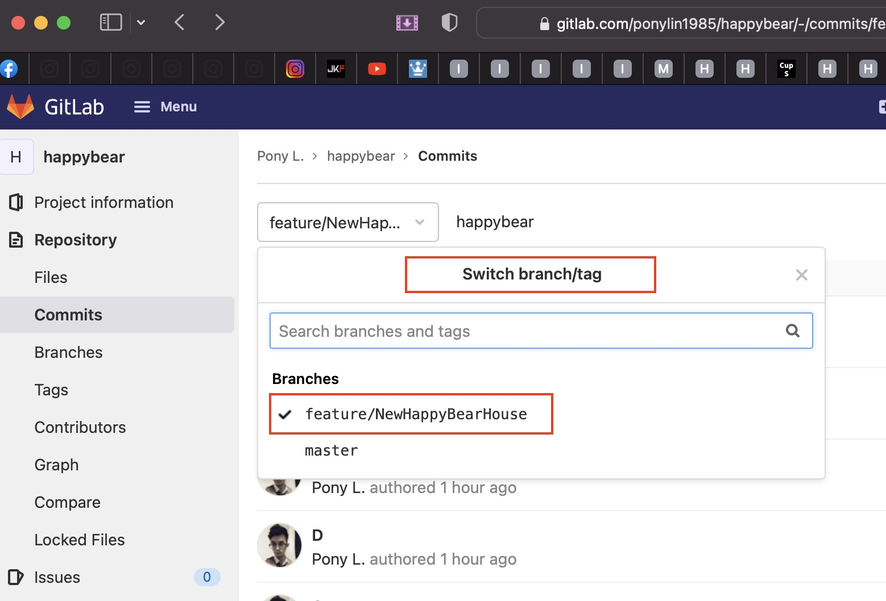
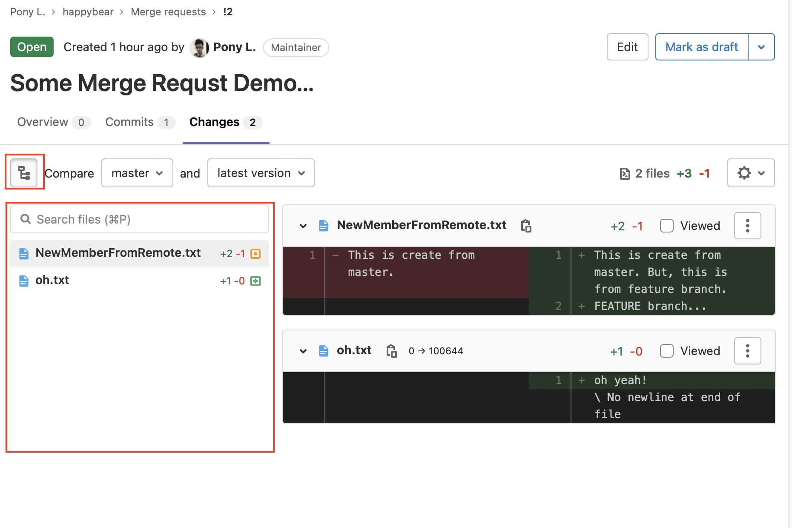
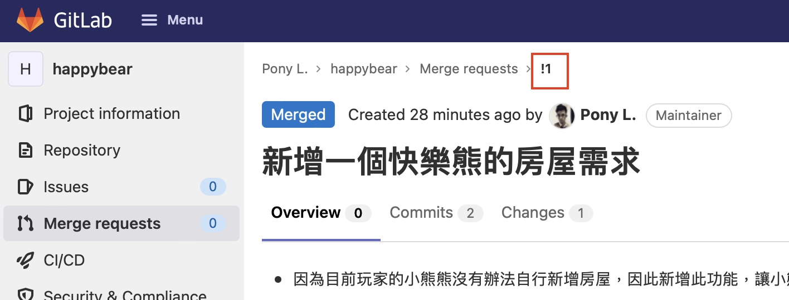

# Git Merge Request 流程。

- 在 GitLab 上使用 Merge Request 要求團隊成員，對於準備要進行 git merge 操作的改動進行 review，然後審核過後再完成 merge 的操作。
- 在 GitHub 上以上行為叫做 **Pull Request**，經常簡稱 **PR**。

----------------------

## GitLab Merge Request 操作流程。

### 使用情境

- 一個 GitLab repo，但有多人共同協作。
- 當某人在 local repo 已經差不多把需求或改動完成，已經在 local 完成 commit，產生了一個或多個新的 git commit 在 local repo 上。
- 但他想要把這些 local git commit 合併到遠端的 remote branch 上。
- 重點關鍵字:
  - 把 local commit merge 到 remote branch 上。
  - 自己的功能已經在 **「個人開發的」local branch 上完成**，想要 merge 回到團隊共同的 branch 上，譬如: `develop` 或 `master` 上。

### 完整操作流程如下

- 假設原本有 `master` 分支，然後有一個需求有我開發，則從 `master` 上執行 `git checkout -b feature/NewHappyBearHouse` 另開一條叫做 `feature/NewHappyBearHouse` 的分支進行開發。
- 現在需求差不多開發完成，已經在 `feature/NewHappyBearHouse` 分支上完成 commit，想要把 `feature/NewHappyBearHouse` 分支的改動合併到 `master` 並且，把這些改動合併到遠端的 `master`。

  - 目標分支: `master`
    - 遠端目標分支: `origin/master`
    - 本地端目標分支: `master`

  - 來源分支: `feature/NewHappyBearHouse`
    - 遠端來源分支: `origin/feature/NewHappyBearHouse`
    - 本地端來源分支: `feature/NewHappyBearHouse`


- Step 1. 先同步遠端目標分支。

  - 原因: 因為遠端的目標分支，可能已經有別人的 commit 比我的需求 $`\textcolor{red}{\text{「還早」merge 回去}}`$，因此可能在 merge 過程中會產生出衝突 (Conflict)，造成 git 或 GitLab 無法直接 auto merge 成功。
    
    - 此時，如果沒有先進行以下的操作，GitLab 也不會允許直接在 GitLab 遠端上進行 merge。(Merge Request 的 `Merge` 按鈕不會出現或會被 disabled 狀態，無法點選。)
    - 原因是因為 GitLab 實際也是在進行 `git merge` 指令操作，當無法直接在 remote repo 完成 auto merge，則一定會在 Merge Request 發出提示訊息，要求人員先在 local repo 更新目標分支的 commit 之後，在 local repo 進行 `git merge`，在 local repo 把 conflicts 解決完成之後，`git push` 更新到遠端之後才允許 GitLab 後續 Merge Request 操作。
  
  - 操作:

    - `git checkout master`

      - 在 local repo 切換到 `master` 目標分支上。

    - `git fetch origin` 或 `git pull origin`

      - 更新 local repo 目標分支的 commit，通常建議 git pull 完成之後，要在此 local branch 進行原始碼 build 的動作。

    

- Step 2. 切換到本地端來源分支，準備進行 merge。

  - 原因: 萬一在 Step 1. 說明的情境發生，需要在 local 先進行 merge from 目標分支，先在 local repo 把衝突在來源分支上解決掉，然後才可以對遠端的 GitLab 發一個 Merge Request，要求把「來源分支」合併到「目標分支」。
    - 把目標分支的 commit 先 merge 到來源分支中。

      - 此合併的方向為: `目標分支 --> 來源分支`。

  - `git checkout feature/NewHappyBearHouse`

    - 在 local repo 切換到 `feature/NewHappyBearHouse` 來源分支上。

  - `git merge master --no-ff --no-commit`

    - 把 `master` 分支的 commit 合併到 `feature/NewHappyBearHouse` 來源分支上。

    - 如果出現衝突，會輸出類似以下的訊息。

      ```
      Auto-merging happybear.txt
      CONFLICT (content): Merge conflict in happybear.txt
      Automatic merge failed; fix conflicts and then commit the result.
      ```

    - 這是後執行 `git status` 應該會有類似以下的輸出。

      ```
      On branch feature/NewHappyBearHouse
      You have unmerged paths.
        (fix conflicts and run "git commit")
        (use "git merge --abort" to abort the merge)

      Changes to be committed:
        new file:   NewMemberFromRemote.txt

      Unmerged paths:
        (use "git add <file>..." to mark resolution)
        both modified:   happybear.txt
      ```

      

    - 然後可以使用 `git diff` 查看檔案內容差異，或是直接使用工具進行檔案 diff compare 並且進行 merge 的操作，以下使用 VS Code 進行操作說明。

      - 首先使用 VS Code 打開當前路徑，點選到 git icon 會列出哪一些檔案是有衝突的 --> 分類在 **Merge Changes** 中。
      - 然後可以逐一點選開有衝突的檔案，在有衝突的段落中，VS Code 會自動待出 git merge conflict 的標記。
      - 此時可以選擇 VS Code 提示的 **Accpet Current Change, Accept Incoming Change 或 Accept Both Change** 進行合併操作。
      - 在合併之前，也可以先選擇 VS Code 提示的 **Compare Changes**，開啟比較工具。

        


        點選 VS Code 的 **Compare Change** 比較工具之後如下圖，在分頁上還會提示 $`\textcolor{red}{\text{左邊是 Current Changes (feature/NewHappyBearHouse 分支的改動)，右邊是 Incoming Changes (master 分支的改動)}}`$。

        

      - 假若這次對於這一份 happybear.txt 檔案的衝突，我想要把 master 的改動和 feature/NewHappyBearHouse 的改動都保留，可以選擇 **Accept Both Change**，之後，然後自行把檔案內容修改成如以下。

        

      - 假若 happybear.txt 檔案的衝突已經處理完成，則需要執行 `git add happybear.txt` 把異動加入到 stage 中，或者可以直接在 VS Code 中把該份檔案加入到 stage 中。然後再執行 `git status` 查看目前 merge 的狀態。

        ```
        On branch feature/NewHappyBearHouse
        All conflicts fixed but you are still merging.
          (use "git commit" to conclude merge)

        Changes to be committed:
          new file:   NewMemberFromRemote.txt
          modified:   happybear.txt
        ```

        

    - 在確認完這次的 merge 操作中，所有的檔案衝突都已經解決之後，則可以執行 `git commit` 完成這一次的 `git merge` 操作。

      - 會顯示類似以下的輸出。

        ```
        [feature/NewHappyBearHouse 52e5b94] Merge branch 'master' into feature/NewHappyBearHouse
        ```

        

    - 執行 `git log` 可以確認這次在 local repo 的 merge 已經操作成功。

      - 只要是屬於 `git merge` 的指令操作，保證會產生出一個新的 git commit 紀錄，沒有例外。
      - 可以看到 git 對於 merge 預設產生的 commit message 類似於: `Merge branch 'master' into feature/NewHappyBearHouse`。
      - 可以看到目前 `feature/NewHappyBearHouse` 分支已經包含 `master` 的 commit，並且檔案也包含剛才 merge 時解除衝突的結果。

        - 下圖中，綠色框框的部分，就是從遠端 remote repo `master` merge 近來到 local repo 的 `feature/NewHappyBearHouse` 分支的 commit。
        - 下圖中，紅色框框的部分，就是剛才執行 `git merge` 最終產生的 git commit 紀錄。

        

- Step 3. 把本地端來源分支推送到遠端的 GitLab repo 上。

  - 原因:
    - 準備要在 GitLab 上建立一個 Merge Request，合併方向為 **From `feature/NewHappyBearHouse` To `master`**。
    - 並且這個 Merge Request 要讓團隊其他成員進行 review。

  - 將本地端合併完成的結果推送到遠端的 GitLab 上。

    - 如果還沒有設定過 upstream。(GitLab 遠端還沒有這一條 `feature/NewHappyBearHouse` 分支時。)

      - `git push origin -u feature/NewHappyBearHouse`

    - 如果已經設定過 upstream。

      - `git push origin`

    

  - 當 `git push` 成功之後，可以去 GitLab 上看一下是否成功推送。

    

    

    

- Step 4. 在 GitLab 上建立 Merge Request。

  - 原因: 把實際原本在來源分支 `feature/NewHappyBearHouse` 的改動合併到遠端 GitLab 目標分支 `master` 中，並且讓團隊成員進行 review。

  - 建立 Merge Request。

    - 最重的的是 先選擇 Merge Request 的 Source Branch 和 Target Branch，如果 Target Branch 不正確可以點選 **Change branches 連結** 重新選擇，如下圖。

      

    - 選擇 Source Branch 和 Target Branch，確認之後，點選 **Compare branches and continue 按鈕**。

      

    - 填寫 Merge Request 的 `Title` 和 `Description`。

      - `Assignees`: 代表這個 Merge Request 主要由誰執行 Merge 動作。
      - `Reviewers`: 代表這個 Merge Request 可以由誰進行 review 和審核的動作，並且還可以在 **Approval rules** 設定此 Merge Request 的審核規則。

      

    - 可以從最下方的 `Commits` 頁籤，觀察出哪些 commit 是在 Source Branch 上存在，但是在 Target Branch 還沒有存在的 commit。

      

    - 可以從最下方的 `Changes` 頁籤，觀察出這次的 Merge Request 實際上有哪些檔案有異動。

      

    - 然後點選 **Create Merge Request** 就完成新增一個 Merge Request 了。

      - 可以從 GitLab Merge Request 點選開，看看是否有一個新增成功，並且狀態為 **Open** 的 Merge Request。

        

        

- Step 5. 在 GitLab 審核 Merge Request。

  - 檢查 Merge Request 和完成合併作業。

    - 通常 review 一個 Merge Request 我們需要 reivew 以下的事項。

      - $`\textcolor{red}{\text{檢查}}`$  `Source Branch` $`\textcolor{red}{\text{和}}`$ `Target Branch` $`\textcolor{red}{\text{是否正確無誤，這是最重要的一件事，這是保證要檢查的，沒有例外!!!}}`$
      - 檢查一下 source branch 與 target branch 原始碼改動的差異，在這個 review 時期，可以是團隊協同 code review 的一個流程。

        - 在 GitLab Merge Request 的 Compare Changes 頁面，可以把差異的檔案樹狀圖展開，也可以設定改為由 list 模式顯示，如下圖。

          

        - 在 GitLab Merge Request 的 Compare Changes 頁面，可以選擇使用 `inline` 或 `side-by-side` 的模式對有異動的檔案進行 compare 比較，GitLab 預設為 `inline` 模式。

          

  - 如果確認這個 Merge Request 沒有問題，就可以按下 Approve 按鈕代表審核此 Merge Request。

- Step 6. 在 GitLab 完成 Merge Request 的合併作業。

  - 只有通過審核的 Merge Request 才可以進行 `Merge` 合併作業。

    

  - 點選 `Merge` 按鈕之後，Merge Request 的狀態就會變成 **Merged**，並且 GitLab 允許你直接進行一些後續操作，譬如 `Revert`、`Cherry-pick` 或 `Delete source branch` 如下圖。

    

  - 也可以去 GitLab 的 Commit 頁面查看 Merge 完成後的結果。

    - Merge Request 一旦完成合併，也絕對會在 Target Branch 上新增出一個新的 git commit，永遠不會有例外。

    

  - 也可以去 GitLab 的 Graph 頁面查詢 Merge 完成後的結果圖形。

    

  - 此時，如果在 local repo 執行 `git checkout master && git remote update && git pull` 指令，就會把 local repo 的 `mater` 更新到 Merge Request 合併完成後的紀錄。


## GitLab Merge Request 補充。

- 在每一次 GitLab 新增一個 Merge Request 之後，GitLab 都會對 Merge Request 產生一個數字編號，在 GitLab 中，想要連結到這個 Merge Requet，可以用 `!` + Merge Request 編號。

  

  

- 在 GitLab 上產生一個 Merge Request 之後，可以把 Merge Request 調整狀態，但 GitLab 不會把 Merge Request 刪除掉，因此前述的那個編號也都會存在。

- 在新增一個 GitLab Merge Request 時，如果在 `Title` 欄位故意輸入 `WIP:` 前綴字，GitLab 就會讓此 Merge Request 的狀態設置為 **wait in process**，不會馬上立即可以 Merge，代表一種處理中的 Merge Request，只是先把 Merge Request 建立出來，還沒有要求進行 reivew 的 Merge Request。

  _(通常如果有使用 GitLab Issue 建立工單或管理工單的團隊，就很可能會有這種自動化產生的 Merge Request!)_

- 每一個有權限對於 GitLab Merge Request 進行 review 和 approve 的成員，都可以直接在 GitLab Merge Request 上每一行的原始碼給出 Comment 建議。(此時會在 Merge Request 上產生一個 `Thread`，可以想像程式討論串。)

  - 在 Merge Request 上只要有任何的 Thread 建議尚未 resolved，該 Merge Request 就不允許進行 `Merge` 操作，直到所有的 Merge Request Thread 都已經變更為 **Resolved** 狀態。

    

    
  
  - 當原作者或其他成員對於 Thread 有回覆時，可以選擇此 Thread 是否已經處理完成，意指 **Thread Resolved**。

    

  - 從 Merge Request 可以看到所有有關於此 Merge Request 的 `git commit`、`git push` 和 `Thread`，也可以看到所有 Thread 的狀態，如下 Thread 狀態已經被設置成 **Resolved**，並且所有 Thread 狀態都是 Resolved，因此允許進行 `Merge` 操作。

    

  - 任何原本已經被 Resolved 的 Thread，在 GitLab Merge Request 上都允許重新被標記為 **Unresolved**，此時上述的流程就會重新需要跑一遍。

- 在 GitLa 上已經新增一個狀態為 Open 的 Merge Request 之後，在還沒有完成 `Merge` 之前，其實原本 Merge Request 的 Source Branch 都允許繼續從 local repo 使用 `git push` 指令更新 GitLab 遠端上的 Source Branch。

  - 所以當 Merge Request 已經建立之後，如果還對 GitLab 遠端的 Source Branch 重新 push commit 到遠端，其實可以不用把原本的 Merge Request 關閉重新開另外一個 Merge Request。
  - GitLab 預設不會把已經 approved 的人員在 Merge Request 上清除掉，_只是建議這種情況發生時，最好能通知 Merge Request 原本已經 approve 過得團隊成員，要求成員重新 review 這個 Merge Request。_ 
    - 因為 Merge Request 最大的意義在於: $`\textcolor{red}{\text{讓團隊成員了解之後這次的 merge 操作有哪些改動，並且同時能進行一定程度上的 code review}}`$。

  

----------------------

- References

  - [Creating merge requests](https://docs.gitlab.com/ee/user/project/merge_requests/creating_merge_requests.html)
  - [Gitlab 合併請求 Merge Request 是什麼](https://wadehuanglearning.blogspot.com/2019/05/git-merge-request.html)
  - [與其它開發者的互動 - 使用 Pull Request (PR)](https://gitbook.tw/chapters/github/pull-request.html)
  - [GitHub 發 PR (pull request) 流程](https://w3c.hexschool.com/git/cc7d70b7)

----------------------

### [回到目錄](../../index.md#目錄)