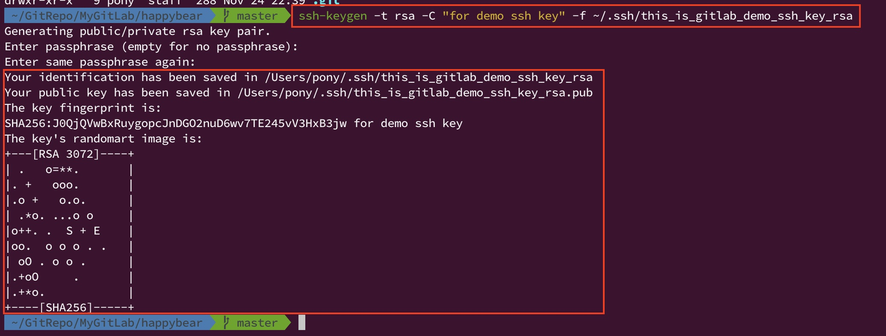

# GitLab - Create A New Git Repo.

- 在 gitlab 上完成註冊之後，就可以自行新增一個 git repo，這個 repo 是存在於 gitlab 的伺服器上，通常對於我們而言會是屬於 remote git repo。

## SSH Key for git remote.

- git 允許你使用 ssh key 建立一個 ssh 安全連線，去存取遠端的 git repo，當然 github 或 gitlab 都包含這個基本的功能，這是最建議連線遠端 repo 的方式。

### 建立一組 ssh key

- 前置步驟: 需要安裝 ssh client，因為需要使用 ssh client 的 `ssh-keygen` 指令產生 ssh key。
  - Linux: 通常 Linux (譬如 ubuntu) 在安裝好了之後，預設就已經有安裝 ssh client 了，如果真的沒安裝，可以自行先安裝，以 ubuntu 來說安裝指令是 `sudo apt install openssh-client`。
  - macOS: 新一點版本的 macOS 出廠時，應該預設都已經安裝好 ssh client 了。
  - Windows: 如果是使用 Windows 10 以上的版本，其實不用額外下載 ssh client 軟體來安裝，Windows 10 預設也有安裝，只是需要額外啟用 ssh client 功能，啟用方式請參考以下連結。
    - [Windows 10 內建的 SSH 工具](https://uncleit.net/windows-10內建的ssh.html)
    - [Windows 10 開始提供 SSH 的程式了](https://kheresy.wordpress.com/2017/12/14/windows-begin-to-provide-ssh-client-and-server/)

  - ssh client 安裝成功之後，可以試著在 terminal 輸入 `ssh` 檢查是否有安裝成功。

- 建立 ssh key 金鑰。

  - `ssh-keygen -t rsa -C {email_address_or_comment} -f {ssh_key_file_path}`

    - `email_address_or_comment`: 你的 email 位址，或者是一個文字註解。
    - `-t`: 指定金鑰型別，指定金鑰的加密演算法，預設會是 rsa，就是 RSA 非對稱式加密演算法。
    - `-f`: 指定金鑰檔案儲存的路徑與檔案名稱。
      - `ssh_key_file_path`: 
        - 產生的 ssh 金鑰的檔名，可以輸入絕對路徑檔名，也可以是相對路徑檔名。
        - 這個檔案名稱，其實可以不用有副檔名，譬如: `id_rsa`，也可以叫做 `gitlab_key`，也可以叫做 `my_super_key.abc`。
        - 如果沒有指定這個 `-f` 參數，ssh-keygen 預設會把產生完成的 ssh 金鑰存放在 `~/.ssh` 目錄下，預設完整檔名為 `~/.ssh/id_rsa`。
        - **其實如果有多個 ssh key，建議還是給定 `-f` 參數，明確給定 ssh key 檔案名稱，並且取名一個自己方便識別的名稱**。

  - 執行完以上 `ssh-keygen` 指令之後，會在 terminal 跳出互動介面，輸出類似以下的訊息，要求你設定 ssh key 的密碼。

    ```
    Enter passphrase (empty for no passphrase):
    Enter same passphrase again: 
    ```

    - 但其實可以都按下 **Enter**，不用輸入。
    - 如果有輸入，之後每次使用到這把 ssh key 連線到 remote git repo 時，都會要輸入這把 ssh key 的密碼，為了方便可以選擇不輸入。

  - ssh 金鑰產生完成訊息類似如下。

    ```
    Your identification has been saved in /Users/dbit/.ssh/id_rsa.
    Your public key has been saved in /Users/pony/.ssh/id_rsa.pub.
    The key fingerprint is:
    SHA256: ----
    The key's randomart image is:-----
    ```

    

  - 檢查一下 ssh key 是否在剛才 `-f` 給定的路徑下，是否有真的產生 ssh key 金鑰。

    - 應該要產生兩個 ssh key，
      - 其中一個是 private ssh key (私鑰)，檔名會是在 `-f` 參數中指定的檔案名稱。
      - 另一個會是 public ssh key (公鑰)，檔名會是在 `-f` 參數中指定的檔案名稱 + `.pub` 結尾當作副檔名。

      

    - 兩把 ssh key 公鑰與私鑰的內容分別類似如下。

      

    - 請切記，這兩把 ssh key 金鑰需要自行保存好，不要外流給其他人員，否則會有安全性上的問題。

  - 注意，如果自己的本機上，$`\textcolor{red}{\text{如果要對多個不同的 git ssh server (git remote 遠端) 進行連線，並且使用不同的 ssh key 進行安全連線時，這種情況下，有可能需要新增或調整}}`$ `~/.ssh/config` $`\textcolor{red}{\text{設定檔，讓 git 知道要用哪一組 ssh key 進行安全加密}}`$，以下為 `~/.ssh/config` 的範例設定。

    ```yml
    Host gitlab.com
        HostName gitlab.com
        User git
        IdentityFile /Users/pony/.ssh/gitlab_id_rsa
        IdentitiesOnly yes

    Host ssh.dev.azure.com
        HostName ssh.dev.azure.com
        User git
        IdentityFile /Users/pony/.ssh/id_rsa
        IdentitiesOnly yes
    ```

    - 以上的 config 設定在告訴本機的 git
      - 嘿，git 請注意，當我的 git remote repo 主機的 URL domain 是 `gitlab.com` 的時候，請使用 `/Users/pony/.ssh/gitlab_id_rsa` 這一組 ssh key 金鑰進行 ssh 連線。
      - 嘿，git 請注意，當我的 git remote repo 主機的 URL domain 是 `ssh.dev.azure.com` 的時候，請使用 `/Users/pony/.ssh/id_rsa` 這一組 ssh key 金鑰進行 ssh 連線。

### 把 ssh public key 公鑰上傳到 gitlab 中

- 接下來，要把剛才產生出的 ssh public key 公鑰上傳到 gitlab 中，之後才可以使用存放在本機的 ssh private key 私鑰存取遠端的 gitlab remote repo。

  - 登入 gitlab 網站後，點選 **右上角 icon** 之後，選擇 **Perferences** 設定頁面。

    

  - 然後選擇左側選單的 **SSH Keys** 功能目錄頁面，新增 ssh key。

    

  - 這時候，要把自己本機上剛才建立出的 ssh public key 公鑰的內容，複製下來，貼到 GitLab SSH Key 頁面上。

    - 先在本機的 terminal 上執行 `cat ~/.ssh/this_is_gitlab_demo_ssh_key_rsa.pub` 指令，然後把 ssh public key 檔案中全部的內容複製下來，ssh public key 內容應該類似如下。(注意，其實中間是沒有任何換行符號的喔!)
    - 注意，要複製的是 **ssh public key 公鑰** 的檔案內容喔，千萬不要去複製 ssh private key 檔案內容。

      ```
      ssh-rsa AAAAB3NzaC1yc2EAAAADAQABAAABgQDT3FeNDEy0TvVFJriv28rh/TBpvWmDW3DX8FGt0WZrohggeG1DKU6ve73wlZllVlOOqy2m9Chtn+LgPKKJQl4uCNnjDinExX9w7gnYJB1fXDQdVibjiJdFXH54P2kJ7LeKQ75AhwQ70UUVjiIUY6WkjxIXcwVgCA5XJM65BVjS9SkGyrtCqdoygSCiLfTZVOlYTb0bDbp7kQq+fxJQW6iRaQPhTcMURW3yZaUgBWSG2uLNnCojq7nYmnPUbMww/Xszip/oqzb6l543556PaMySSTZyCYNzTMFteVHRDu3GLTQss1sh+zJWBobrkJHNGAt+k7wwUxGMQ17rw7xAjVLyUrWA4vLyGOjoWZ22hdUYowdQUWa4YhmHo6N6YfHvrWSgZaiZHPXW/OIktYKX+eRAm2wtpfz/py3jPQLy+jAA6Cgqu5jNB4luWLe+KrishqAqvgMz73e/qWDeO0CFpPrsXEsTdfYhGqGMai8ErN6yDQ0V81LIift6Oy1DoDBENUs= for demo ssh key
      ```

    - 把 ssh public key 檔案內容複製貼到 GitLab 上面的 `Key` 欄位中。
      
      - 然後 GitLab 預設會自動自動預設帶出 `Title` 欄位，但也可以修改，可以自行決定，$`\textcolor{red}{\text{其實建議設定一個可以方便識別 device 機器名稱的 Title 比較好!}}`$。
      
        

    - 確認之後，點選 `Add Key` 按鈕，然後會出現以下的畫面。

      

      

- 這樣就把 ssh key 上傳到 gitlab 上傳成功了，就可以使用 ssh 連線存取 gitlab remote repo 了。

----------------------

## Add Blank Git Repository at GitLab (在 GitLab 上 新增一個空白的 Git Repo)

- 當在 gitlab 上成功新增了一個 repo 之後，就可以使用 `git clone` 指令把遠端的 remote repo 複製到 local 本機上，並且在本機上建立一個 local git repo。

- 複製 gitlab remote repo 上的 URL 位址，如下圖。

  - URL 如果是 `https` 前綴開頭，代表會使用 https protocol 連線，通常至少會需要輸入一次 gitlab 帳密，之後作業系統應該會儲存起來。
  - URL 如果是 `git@` 前綴開頭，代表會使用 ssh protocal 連線，如果 ssh key 沒有設定密碼，每一次連線基本上都不需要輸入 gitlab 帳密，建議使用!

  

----------------------

## Git Clone

- 執行 `git clone` 上之前，請記得在 terminal 上先使用 `cd` 指令切換到 **自己預期要在哪一個路徑下建立 local git repo 的目錄下**。

- `git clone {remote_repo_url}`

  - `remote_repo_url`: 遠端 git remote 連線的 URL 位址。

    - 使用 https 連線範例: `git clone https://gitlab.com/ponylin1985/git-instructions.git`
    - 使用 ssh 連線範例: `git clone git@gitlab.com:ponylin1985/git-instructions.git`

- 當 `git clone` 成功之後，在 local 本機上，會在 terminal 當前路徑下建立一個 local git repo 倉儲。
  
  - 因此 `cd` 到這個目錄之後也會有 `.git` 隱藏目錄，也可以執行所有 git CLI 指令。
  - 預設 `git clone` 會在 local 當前目錄下建立 remote repo name 的目錄。
    - 譬如: gitlab repo 名稱叫做 **kk-ticks-self-test**，git clone 則會建立一個 `./kk-ticks-self-test` 目錄。

  - 假設不喜歡 gitlab repo 原本的 repo name，可以在 `git clone` 時自行指定一個 **別名 (Alias)**。

    - `git clone {remote_repo_url} {local_alias}`

      - 譬如，
      
        - gitlab repo 名稱  原本叫做 **kk-ticks-self-test**。
        - 在 local 本機 terminal 的 `~/git-repos/gitlab-repos/` 路徑下執行 `git clone git@gitlab.com:ponylin1985/kk-ticks-self-test.git kk-ticks-smoking-test` 指令之後。
        - git 會在 local 本機的 `~/git-repos/gitlab-repos/` 路徑下建立一個 `kk-ticks-smoking-test` 目錄，完整路徑為 `~/git-repos/gitlab-repos/kk-ticks-smoking-test`。
        - 當 `cd` 到 `~/git-repos/gitlab-repos/kk-ticks-smoking-test` 路徑時，這個路徑就會把所有 gitlab repo 上的 commit 和檔案複製下來，並且建立一個完全獨立的 local repo。
        - 此時在 `~/git-repos/gitlab-repos/kk-ticks-smoking-test` 執行 `git remote -v` 可以看到類似以下的輸出。

          ```
          origin  git@gitlab.com:ponylin1985/kk-ticks-self-test.git (fetch)
          origin  git@gitlab.com:ponylin1985/kk-ticks-self-test.git (push)
          ```

        - 並且在 kk-ticks-smoking-test local repo 中，任何一條 branch 中，執行 `git branch -a` 之後，可以觀察出各個 local branch 的 upsteam 就是 `origin`，而 `origin` 還是指向剛才 clone 下來的 gitlab remote URL。

          - 其中如果 branch 是屬於 remote repo 的 remote banch，格式如下。

            - `remotes/{remote_name}/{remote_branch_name}`

          - 實際範例如下。

            - `*` 是代表目前的 local repor HEAD 指向哪一條 local branch 的最後一個 commit。因此 `*` 基本上不可能去直接指向一條 remote branch。
            - 由 `remotes/` 當作前綴開頭的，即為 remote branch。

            ```
              develop
            * feature/dotnet6-upgrade
              feature/test-ci-pipeline
              master
              release/dotnet-standard2.0
              remotes/origin/develop
              remotes/origin/feature/ServiceActionLocator
              remotes/origin/feature/dotnet6-upgrade
              remotes/origin/feature/test-ci-pipeline
              remotes/origin/master
              remotes/origin/release/dotnet-standard2.0
            ```

----------------------

- References

  - [Git 基礎 - 與遠端協同工作](https://git-scm.com/book/zh-tw/v2/Git-基礎-與遠端協同工作)
  - [設定 Upstream](https://zlargon.gitbooks.io/git-tutorial/content/remote/upstream.html)

----------------------

### [回到目錄](../../index.md#目錄)

