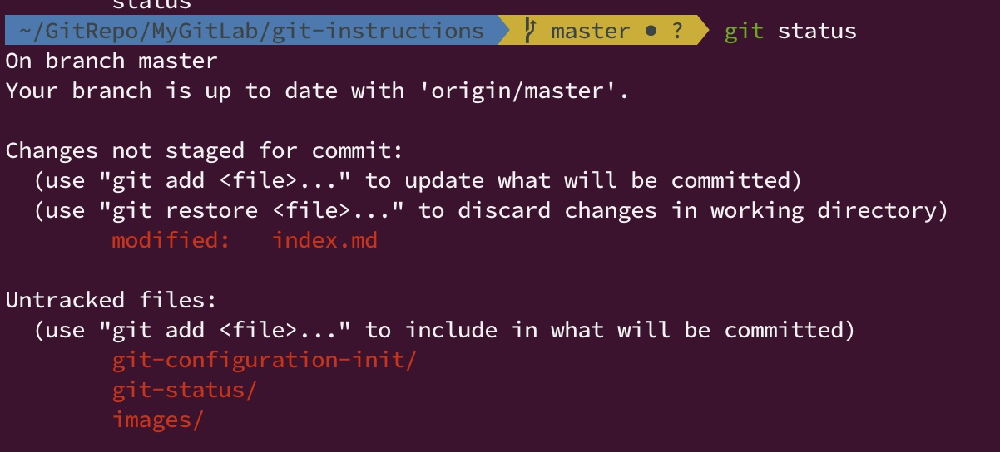

# Git Status & Git Commit & Git Undo

## Git Status & Git Undo

- `git status`

  - 顯示出檔案狀態。
  - 顯示出目前的分支。(如果已經有 upstream，會顯示 upstream 的 branch 名稱，如下。)

  輸出範例如下:

  ```
  On branch master
  Your branch is up to date with 'origin/master'.

  Changes not staged for commit:
    (use "git add <file>..." to update what will be committed)
    (use "git restore <file>..." to discard changes in working directory)
    modified:   index.md

  Untracked files:
    (use "git add <file>..." to include in what will be committed)
    git-configuration-init/
    git-status/
    images/
  ```

  

- 此為查看 git repo 中，目前當下所有檔案的異動狀態，以及當前 git branch 狀態最重要的指令。

  - 狀態主要分為以下兩大類型: $`\textcolor{red}{\text{紅色}}`$ and $`\textcolor{green}{\text{綠色}}`$。

    - $`\textcolor{green}{\text{綠色狀態 Changes to be committed (將要確認的檔案)}}`$
    - $`\textcolor{red}{\text{紅色狀態 Changes not staged for commit (被更動但尚未要確認的檔案)}}`$
    - $`\textcolor{red}{\text{紅色狀態 Untracked files (新被加入到 git repo 中，但是還沒有被 git 版本控管的檔案)}}`$

  - 只有綠色狀態的檔案，在執行 `git commit` 的時候，才會真的被加入到 git commit 紀錄中，執行 `git log` 時才會看到紀錄。
  - 當你想要從紅色狀態變成綠色狀態，需要使用 `git add` 指令，把檔案加入到 stage 中。

    - `git add .` --> 代表把該 git repo 中所有檔案都加入到 stage 中，變成綠色狀態。
    - `git add ./source/cool.py` --> 只有把 **./source/cool.py** 檔案加入到 stage 變成綠色狀態。

- 如果想要把修改的檔案變成原本 **未更動** 的狀態。

  - 當檔案狀態為 $`\textcolor{red}{\text{紅色狀態 Changes not staged for commit}}`$，可以使用以下指令。

    - `git checkout -- {path_or_file}`

      - `path_or_file`: 檔案在當前目錄下的相對路徑，或絕對路徑。
      - `path_or_file`: 可以輸入多個檔案，譬如: `./note1.txt ./note2.txt ./happy.py`。
      - `path_or_file`: 也可以輸入路徑，譬如: `./something`。

    - 譬如，只想要把 **./source/cool.py** 這一份檔案變成 **未更動的狀態**。

      - `git checkout -- ./source/cool.py`

    - 如果想把 git repo 下所有的 $`\textcolor{red}{\text{紅色狀態 Changes not staged for commit}}`$ 檔案還原成 **未更動的狀態**。

      - `git checkout -- .`

  - 當檔案狀態為 $`\textcolor{green}{\text{綠色狀態 Changes to be committed}}`$ 時，需要先使用以下指令，讓他變成 $`\textcolor{red}{\text{紅色狀態 Changes not staged for commit}}`$ ，然後才能再使用以上指令把它變成 **未更動的狀態**。

    - `git reset HEAD -- {path_or_file}`

      - `path_or_file`: 檔案在當前目錄下的相對路徑，或絕對路徑。
      - `path_or_file`: 可以輸入多個檔案，譬如: `./note1.txt ./note2.txt ./happy.py`。
      - `path_or_file`: 也可以輸入路徑，譬如: `./something`。

    - 譬如，假設目前 **./source/cool.py** 檔案是 $`\textcolor{green}{\text{綠色 Changes to be committed}}`$，想要完全還原到未更動的狀態，則需要依序執行以下指令。

      - `git reset HEAD -- ./source/cool.py`
      - `git checkout -- ./source/cool.py`

  - 當檔案狀態為 $`\textcolor{red}{\text{紅色狀態 Untracked files}}`$，不想被加入到 git repo 被版本控管中。

    - `git rm {path_or_file}`
    - 或是就直接把不想要的檔案刪除掉就好，譬如: `rm {path_or_file}`

- 如果想要把刪除的檔案還原成原本未刪除的版本。

  - 當檔案狀態為 $`\textcolor{red}{\text{紅色狀態 Changes not staged for commit}}`$，可以使用以下指令。

    - `git checkout -- {path_or_file}`

  - 當檔案狀態為 $`\textcolor{green}{\text{綠色狀態 Changes to be committed}}`$ 時，需要執行以下指令。

    - 首先，需要先把檔案狀態還原成「未進入 stage」的 $`\textcolor{red}{\text{紅色狀態 Changes not staged for commit}}`$，所以先執行以下指令。

      - `git reset HEAD -- {path_or_file}`

      - `git restore --staged -- {path_or_file}` (如果你安裝的 git 版本在 v2.23 (2019-08) 之後，可以使用這個新的 restore 指令。)

    - 然後再把檔案從 $`\textcolor{red}{\text{紅色狀態 Changes not staged for commit}}`$，還原成未刪除之前的版本。

      - `git checkout -- {path_or_file}`

### _最後補充一招，可能需要知道，但是期望日常工作中不要太常用到的招數，我們要來使用 `git reset` 這個指令。_

- 當刪除了某一些檔案，$`\textcolor{red}{\text{而且，幹! 不小心真的 commit 了，然後你想要把這些檔案 undo 還原回來，怎麼辦?}}`$

  - 第一種辦法: 希望你的「資源回收桶中」還有之前被刪除了檔案。

    - 你可以試著用這一招，但是如果你從資源回收桶中還原，這樣又需要再重新 `git commit` 一次，如果你不會 `git rebase` 這種妖招去把「不小心刪除掉的 commit」和「重新把資源回收桶中的檔案救回來的 commit」合併成一個 commit 就 push 到 remote 的時候，很可能會被一些雞巴的同事嘲笑你 git 不熟練... _(雖然他很可能也不見得會以下招數...)_

  - 第二種辦法: 你可以使用 `git reset` 指令直接把 HEAD 指向之前勿刪除檔案的 commit，用以救回你的檔案。

    - 假設情境如下

      原本有這些檔案。

      ```
      $ ls -la

      total 32
      drwxr-xr-x   7 pony  staff  224 Nov 30 23:16 .
      drwxr-xr-x  12 pony  staff  384 Nov 25 02:35 ..
      drwxr-xr-x  14 pony  staff  448 Nov 30 23:16 .git
      -rw-r--r--   1 pony  staff   80 Nov 28 18:34 NewMemberFromRemote.txt
      -rw-r--r--   1 pony  staff   63 Nov 28 15:28 happybear.txt
      -rw-r--r--   1 pony  staff   10 Nov 28 14:46 happybear2.txt
      -rw-r--r--   1 pony  staff    8 Nov 30 23:16 oh.txt
      ```

      然後你不小心跑到下面這些指令，把 `./oh.txt` 檔案刪除掉了。

      `rm ./oh.txt` (啊... 靠邀...)

      `git commit -a -m "OH FUCK"` (啊... 靠邀... 幹... 慘了...)

      這時候，你已經不小心把誤刪除了一個檔案，並且還已經 commit 了... 而也這時候用 `git log` 去看，還真的會看到一個 commit message 是 `OH FUCK` 的 git commit... 就差沒 push 否則就要被雞巴同事嘲笑了...<br/>
      你發現 oh.txt 真的被刪掉了...

      ```
      $ ls -la

      total 24
      drwxr-xr-x   6 pony  staff  192 Nov 30 23:26 .
      drwxr-xr-x  12 pony  staff  384 Nov 25 02:35 ..
      drwxr-xr-x  15 pony  staff  480 Nov 30 23:27 .git
      -rw-r--r--   1 pony  staff   80 Nov 30 23:25 NewMemberFromRemote.txt
      -rw-r--r--   1 pony  staff   63 Nov 30 23:25 happybear.txt
      -rw-r--r--   1 pony  staff   10 Nov 28 14:46 happybear2.txt
      ```

      這時候先不用怕，先執行一次 `git log --graph` 指令，看一下 commit log，會出現類似以下的輸出。

      ```
      $ git log --graph

      * commit 117c7730eacc59afeb2f833f5839877c704e520d (HEAD -> feature/NewHappyBearHouse)
      | Author: ponylin1985 <ponylin1985@gmail.com>
      | Date:   Tue Nov 30 23:26:53 2021 +0800
      |
      |     OH FUCK
      |
      * commit f944820f3053291865f1a0389313b0f3bf4545ba (origin/feature/NewHappyBearHouse)
      | Author: ponylin1985 <ponylin1985@gmail.com>
      | Date:   Sun Nov 28 18:35:18 2021 +0800
      |
      |     G
      |
      *   commit 52e5b945ce796280c4f31d5d81b77fc1e15b5b03
      |\  Merge: b3746db 5a2389d
      | | Author: ponylin1985 <ponylin1985@gmail.com>
      | | Date:   Sun Nov 28 15:53:39 2021 +0800
      | |
      | |     Merge branch 'master' into feature/NewHappyBearHouse
      | |
      | * commit 5a2389db9a30d437bad71e1ed9fed0d0cb114c95 (master)
      | | Author: Pony L <ponylin1985@gmail.com>
      | | Date:   Sun Nov 28 07:16:30 2021 +0000
      | |
      | |     F Update happybear.txt
      | |
      | * commit d8d29a99b276111165b58f6899bb1b191f3c0b74
      | | Author: Pony L <ponylin1985@gmail.com>
      | | Date:   Sun Nov 28 06:49:51 2021 +0000
      | |
      | |     E This is create from master.
      ```

      其實只要把 commit 還原成，message 為 `G` 的那一個 commit 就好，因此把 `G` 這一個 commit 的 commit id 複製下來，也就是複製 `f944820f3053291865f1a0389313b0f3bf4545ba` 這一個 commit id。<br/>
      然後執行 `git reset {commit_id}` 指令如下。

        - `git reset {commit_id}` --> `git reset f944820f3053291865f1a0389313b0f3bf4545ba`

          ```
          $ git reset f944820f3053291865f1a0389313b0f3bf4545ba

          Unstaged changes after reset:
          D	oh.txt
          
          $ git status

          On branch feature/NewHappyBearHouse
          Your branch is up to date with 'origin/feature/NewHappyBearHouse'.

          Changes not staged for commit:
            (use "git add/rm <file>..." to update what will be committed)
            (use "git restore <file>..." to discard changes in working directory)
            deleted:    oh.txt

          no changes added to commit (use "git add" and/or "git commit -a")
          ```

          - 這樣你就會回復到 `G` (f944820f3053291865f1a0389313b0f3bf4545ba) 這個 commit，**但是之前不小心刪除檔案的狀態仍會存在，目前狀態就是處於** $`\textcolor{red}{\text{紅色狀態 Changes not staged for commit}}`$。

        - `git reset {commit_id} --hard` --> `git reset f944820f3053291865f1a0389313b0f3bf4545ba --hard`

          ```
          $ git reset f944820f3053291865f1a0389313b0f3bf4545ba --hard

          HEAD is now at f944820 G
          
          $ git status
          
          On branch feature/NewHappyBearHouse
          Your branch is up to date with 'origin/feature/NewHappyBearHouse'.

          nothing to commit, working tree clean
          ```

          - 這樣你就會 **完全回到 `G` (f944820f3053291865f1a0389313b0f3bf4545ba) 這個 commit，並且之前誤刪除檔案的那個 commit 就真的不見了**，從 `git log` 也查到不到了。
          - 因此，如果要使用 `git reset --hard` 也是可以，只是真的要格外小心操作，否則之前 **最後一個 commit** 就會真的不見...

  - 好了，現在你已經把 `oh.txt` 檔案救回來了，而且是用 git CLI 的手法，可以安心的 `git push` 了，沒人知道你不小心手滑誤刪過任何檔案... (爽啦...)


- 請注意，以上所有 `git status`、`git checkout` 或 `git reset` 操作，都不會顯示或對已經被 `.gitignore` 排除在版本控管之外的檔案有影響。
  - 假設原本在 `.gitignore` 檔案中把所有 `*.jpg` 檔案排除在版本控管之外，但是因為某一次的改動，必須要把一張 `./source/images/ABC.jpg` 的圖片檔加入到版本控管中，並且只想把這一張圖加入版本控管，其餘 `*.jpg` 仍要排除在外，則可以使用以下方式。

    - 指令樣板: `git add --force {file}`
    - 實際指令: `git add --force ./source/images/ABC.jpg`

----------------------

## Git Commit

- commit
  - 當 **名詞** 使用時: 代表每一次 **異動紀錄**，實際儲存在 `./.git` 隱藏目錄中。
  - 當 **動詞** 使用時: 代表已經確認過 `git status` 檔案狀態，**確認這一次的改動並且儲存**，成功儲存之後就會產生一個 **當作名詞用的 commit**。
    - 產生了 git commit 之後，使用 `git log` 指令，則可以觀察所有 commit 紀錄。
    - 對於 git 版本控管而言，所有東西其實都是 git commit。

- `git commit`

  - 確認此次的修改，或新增的檔案，將 $`\textcolor{green}{\text{綠色 Changes to be committed}}`$ 的檔案，加入到 git commit 紀錄中。
  - 輸入此指令時，會自動跳出 console 介面或 GUI 介面的 text editor，譬如 nano、vi、vim 或 notepad++，要求輸入「確認訊息，在完成 commit message 並且儲存之後，才會真的產生 git commit。

- `git commit -m {commit_message}`

  - 直接可在 `{commit_message}` 中輸入 **一行** 的訊息。

- `git commit -a`

  - 自動在 commit 的當下把檔案狀態變成綠色。

- `git commit --amend`

  - 修改尚未 `git push` 之前，最後一次的 commit message。

- `git commit --amend -m {commit_message}`

  - 同上，只是可以直些輸入一行的 commit message。

- commit message 建議描述出
  - 因為什麼樣的原因或需求要進行此次修改與調整。
  - 如果修改的檔案很多，大致描述出這次修改主要是為了什麼目的改動。
  - 補上一些可能遺漏的但很重要到的細節。
  - 最爛的 commit message 範例如下。

    ```
    - bugfix for payment api.
    - add new files in cps api.
    ```

----------------------

- References

  - [檔案狀態](https://zlargon.gitbooks.io/git-tutorial/content/file/status.html)
  - [啊！不小心把檔案或目錄刪掉了](https://gitbook.tw/chapters/using-git/recover-deleted-files.html)
  - [Can I use "git checkout --" on two files?](https://stackoverflow.com/questions/28555062/can-i-use-git-checkout-on-two-files)
  - [How do I remove a single file from the staging area (undo git add)?](https://stackoverflow.com/questions/1505948/how-do-i-remove-a-single-file-from-the-staging-area-undo-git-add)
  - [How to undo (almost) anything with Git](https://github.blog/2015-06-08-how-to-undo-almost-anything-with-git/) 極度推薦這一篇，講解的真的很詳細。
  - [git操作之二：git restore](https://iter01.com/557042.html)

----------------------

### [回到目錄](../index.md#目錄)
